<!-- <h1>{{ page.abcd }}</h1> -->


<!-- presentation:
  theme: white.css
  width: 800
  height: 600 -->

<!-- Content [^1]
[^1]: Hi! This is a footnote -->

<!-- ```javascript {cmd="node"}
const date = Date.now()
console.log(date.toString())
``` -->
<!-- ___ -->

# VS Code Setup

## VS Extensions

| ID                                  | Name                                                                                                                 |
|-------------------------------------|----------------------------------------------------------------------------------------------------------------------|
| shd101wyy.markdown-preview-enhanced | [Markdown Preview Enhanced](https://marketplace.visualstudio.com/items?itemName=shd101wyy.markdown-preview-enhanced) |

- [Documentation](https://shd101wyy.github.io/markdown-preview-enhanced/#/) 


### Front-Matter

https://jekyllrb.com/docs/front-matter/

#### YAML

https://yaml.org/


### Side Table Of Contents

1. Right click the gear next to the extension and click on "**Extension Settings**".
    @import "assets\images\SettingSnippet_EditExtensionSetting.JPG" 

2. Set the following setting to allow the side table of contents [^SideTOC] :
    @import "assets\images\SettingSnippet_EnableScriptExecution.JPG" 

3. Copy and paste this at the **top** of the markdown file:
    - The title is the HTML title.
    ```
    ---
    title: "HTML Title"
    toc:
        depth_from: 1
        depth_to: 6
        ordered: false
        ignoreLink: true
    html:
        embed_local_images: true
        embed_svg: true
        offline: true
        toc: true
    ---
    ```


[^SideTOC]: https://shd101wyy.github.io/markdown-preview-enhanced/#/html?id=configuration 

---

### CSS Styling

[^CustomCSS]: https://shd101wyy.github.io/markdown-preview-enhanced/#/customize-css

1. Press **CTRL** + **SHIFT** + **P**.
2. Type "**Customize CSS**".
    @import "assets\images\SettingSnippet_CustomizeCSS.JPG"

<!-- 3. Paste the following CSS code in your **.less** file [^CustomCSS].
    - _You can modify the CSS to your liking._    

@import "C:\Users\bphommathep.TOTALMM\.mume\style.less" {code_block=true } -->


### Default Open TOC

Add the below snippet to have the side TOC start opened.

```
    ```js {cmd hide}
    document.getElementsByTagName('body')[0].setAttribute('html-show-sidebar-toc', true);
    ```
```

```
    ```js {cmd hide}
    window.onload = () => {
        document.getElementsByTagName('body')[0].setAttribute('html-show-sidebar-toc', true);

        var activelinkClassName = 'toc-active-link';
        document.querySelectorAll('.md-sidebar-toc a')[0].classList.add(activelinkClassName);

        window.onscroll = () => {
            function getHeaderLinkId() {
                var headers = document.querySelectorAll('h1, h2, h3, h4, h5, h6');

                if (headers === undefined && headers.length === 0)
                    return;
                    
                // Bottom of the page => Use last link
                if ((window.innerHeight + window.scrollY) >= document.body.offsetHeight)
                    return headers[headers.length - 1].id;
                
                for (let i = 0; i < headers.length; i++) {
                    var top = headers[i].getBoundingClientRect().top;
                
                    if (top > 0) {
                        if (top < 10) {
                            return headers[i].id;
                        } else {
                            return (headers[i - 1] !== undefined) ? 
                                headers[i - 1].id : headers[i].id;
                        }
                    }
                }
            }
            
            function getActiveTOCLink(id){
                var links = document.querySelectorAll('.md-sidebar-toc a');
                for (let i = 0; i < links.length; i++) {
                    if (links[i].href.includes(id))
                        return links[i];
                }
            }
            
            function resetLinks(){
                var activelinks = document.querySelectorAll('.' + activelinkClassName);
                for (let i = 0; i < activelinks.length; i++) {
                    activelinks[i].classList.remove(activelinkClassName);
                }
            }
            
            var headerId = getHeaderLinkId();
            if (headerId !== undefined) {
                var tocElement = getActiveTOCLink(headerId)
                
                if (tocElement !== null && tocElement !== undefined) {
                    resetLinks();
                    tocElement.classList.add(activelinkClassName);
                }
            }
        }
    }

    ```
```

---

### Presentation Mode

https://shd101wyy.github.io/markdown-preview-enhanced/#/presentation

#### Settings

```yaml
---
presentation:
    # presentation theme
    # === available themes ===
    # "beige.css"
    # "black.css"
    # "blood.css"
    # "league.css"
    # "moon.css"
    # "night.css"
    # "serif.css"
    # "simple.css"
    # "sky.css"
    # "solarized.css"
    # "white.css"
    # "none.css"
    theme: white.css

    # The "normal" size of the presentation, aspect ratio will be preserved
    # when the presentation is scaled to fit different resolutions. Can be
    # specified using percentage units.
    width: 960
    height: 700

    # Factor of the display size that should remain empty around the content
    margin: 0.1

    # Bounds for smallest/largest possible scale to apply to content
    minScale: 0.2
    maxScale: 1.5

    # Display controls in the bottom right corner
    controls: true

    # Display a presentation progress bar
    progress: true

    # Display the page number of the current slide
    slideNumber: false

    # Push each slide change to the browser history
    history: false

    # Enable keyboard shortcuts for navigation
    keyboard: true

    # Enable the slide overview mode
    overview: true

    # Vertical centering of slides
    center: true

    # Enables touch navigation on devices with touch input
    touch: true

    # Loop the presentation
    loop: false

    # Change the presentation direction to be RTL
    rtl: false

    # Randomizes the order of slides each time the presentation loads
    shuffle: false

    # Turns fragments on and off globally
    fragments: true

    # Flags if the presentation is running in an embedded mode,
    # i.e. contained within a limited portion of the screen
    embedded: false

    # Flags if we should show a help overlay when the questionmark
    # key is pressed
    help: true

    # Flags if speaker notes should be visible to all viewers
    showNotes: false

    # Number of milliseconds between automatically proceeding to the
    # next slide, disabled when set to 0, this value can be overwritten
    # by using a data-autoslide attribute on your slides
    autoSlide: 0

    # Stop auto-sliding after user input
    autoSlideStoppable: true

    # Enable slide navigation via mouse wheel
    mouseWheel: false

    # Hides the address bar on mobile devices
    hideAddressBar: true

    # Opens links in an iframe preview overlay
    previewLinks: false

    # Transition style
    transition: 'default' # none/fade/slide/convex/concave/zoom

    # Transition speed
    transitionSpeed: 'default' # default/fast/slow

    # Transition style for full page slide backgrounds
    backgroundTransition: 'default' # none/fade/slide/convex/concave/zoom

    # Number of slides away from the current that are visible
    viewDistance: 3

    # Parallax background image
    parallaxBackgroundImage: '' # e.g. "'https://s3.amazonaws.com/hakim-static/reveal-js/reveal-parallax-1.jpg'"

    # Parallax background size
    parallaxBackgroundSize: '' # CSS syntax, e.g. "2100px 900px"

    # Number of pixels to move the parallax background per slide
    # - Calculated automatically unless specified
    # - Set to 0 to disable movement along an axis
    parallaxBackgroundHorizontal: null
    parallaxBackgroundVertical: null

    # Parallax background image
    parallaxBackgroundImage: '' # e.g. "https://s3.amazonaws.com/hakim-static/reveal-js/reveal-parallax-1.jpg"

    # Parallax background size
    parallaxBackgroundSize: '' # CSS syntax, e.g. "2100px 900px" - currently only pixels are supported (don't use % or auto)

    # Number of pixels to move the parallax background per slide
    # - Calculated automatically unless specified
    # - Set to 0 to disable movement along an axis
    parallaxBackgroundHorizontal: 200
    parallaxBackgroundVertical: 50

    # Enable Speaker Notes
    enableSpeakerNotes: false
---


```


---

### Pandoc

https://shd101wyy.github.io/markdown-preview-enhanced/#/pandoc

---

# Abbreviations

*[HTML]: Hyper Text Markup Language
*[W3C]: World Wide Web Consortium

The HTML specification
is maintained by the W3C.


---


# Importing Files

* [Reference](https://shd101wyy.github.io/markdown-preview-enhanced/#/file-imports)
* You can import files using the @import keyword.

## Supported file types
- `.jpeg(.jpg), .gif, .png, .apng, .svg, .bmp` file will be treated as markdown image.
- `.csv` file will be converted to markdown table.
- `.mermaid` file will be rendered by mermaid.
- `.dot` file will be rendered by viz.js (graphviz).
- `.plantuml(.puml)` file will be rendered by PlantUML.
- `.html` file will be embedded directly.
- `.js` file will be included as `<script src="your_js"></script>`.
- `.less` and `.css` file will be included as style. 
    - Only local `.less` file is currently supported. 
    - `.css` file will be included as `<link rel="stylesheet" href="your_css">`.
- .pdf file will be converted to svg files by pdf2svg and then be included.
- `.md` file will be parsed and embedded directly.
- All other files will be rendered as code block.


## Images
```
@import "test.png" {width="300px" height="200px" title="my title" alt="my alt"}
```

## Online Files
```
@import "https://raw.githubusercontent.com/shd101wyy/markdown-preview-enhanced/master/LICENSE.md"
```

## Code Files
```
@import "C:\Users\bphommathep.TOTALMM\.mume\style.less" { code_block=true }
@import "C:\Users\bphommathep.TOTALMM\.mume\style.less" {code_block=true class="line-numbers"}
```

### JSON
```
@import "test.json" {as="vega-lite"}
```

### Certain Lines
```
@import "test.md" {line_begin=2}
@import "test.md" {line_begin=2 line_end=10}
@import "test.md" {line_end=-4}
```

### Code Chunk (Executable Code Block)
```
@import "test.py" {cmd="python3"}
@import "test.js" {cmd="node"}
```


---

# Graphs & Diagrams

## [Mermaid Diagrams](https://github.com/mermaid-js/mermaid)

Documentation: https://github.com/mermaid-js/mermaid

https://mermaid-js.github.io/mermaid/#/


### Simple Example

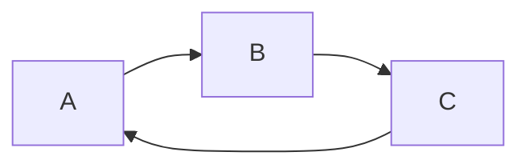

````
    ``` mermaid {align="center"}
    graph LR
        A --> B;
        B --> C;
        C --> A;
    ```
````

---

### Flow Chart

https://mermaid-js.github.io/mermaid/#/flowchart


---


#### Example {ignore}

````
    ```mermaid {align="center"}
    graph TD
    A[Hard] -->|Text| B(Round)
    B --> C{Decision}
    C -->|One| D[Result 1]
    C -->|Two| E[Result 2]
    ```
````


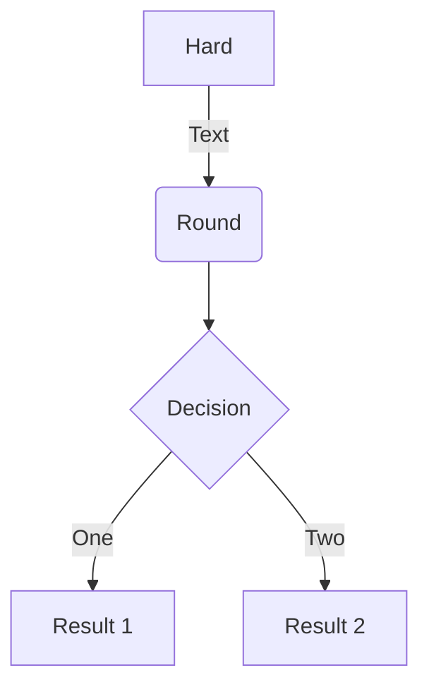

---

#### Orientation {ignore}

| Orientation | Description                     |
|:-----------:|---------------------------------|
| `graph TB`  | top to bottom                   |
| `graph TD`  | top-down/ same as top to bottom |
| `graph BT`  | bottom to top                   |
| `graph RL`  | right to left                   |
| `graph LR`  | left to right                   |


---


#### Lines {ignore}

- For dotted or thick links, the characters to add are equals signs or dots, as summed up in the following table:


| Length            |   1    |    2    |    3     |
|-------------------|:------:|:-------:|:--------:|
| Normal            | `---`  | `----`  | `-----`  |
| Normal with arrow | `-->`  | `--->`  | `---->`  |
| Thick             | `===`  | `====`  | `=====`  |
| Thick with arrow  | `==>`  | `===>`  | `====>`  |
| Dotted            | `-.-`  | `-..-`  | `-...-`  |
| Dotted with arrow | `-.->` | `-..->` | `-...->` |


---


#### Subgraphs {ignore}


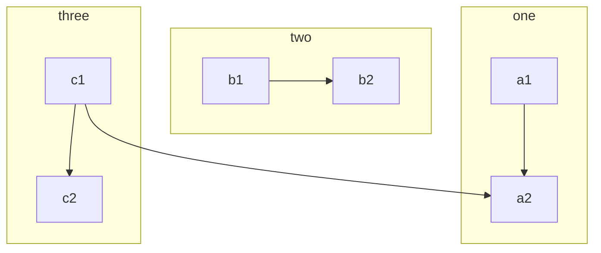

---

#### Node Shapes & Edges


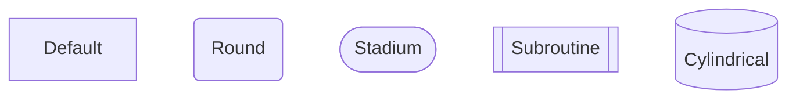

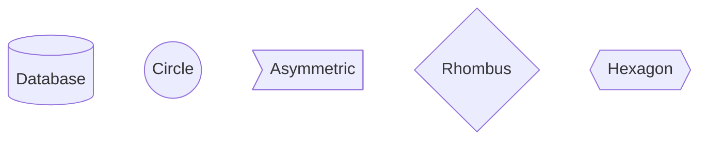


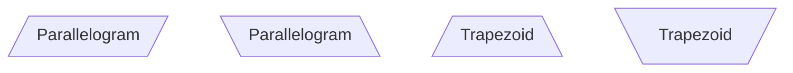

---

##### Default {ignore}

```
    ```mermaid {align=center}
    graph LR
        id1[Default]
    ```
```

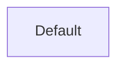

---


##### Round Edges {ignore}

```
    ```mermaid {align=center}
    graph LR
        id1(Round)
    ```
```

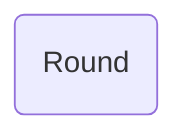

---


##### Stadium-Shaped Node {ignore}


```
    ```mermaid {align=center}
    graph LR
        id1([Stadium])
    ```
```

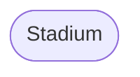

---


##### Subroutine {ignore}

```
    ```mermaid {align=center}
    graph LR
        id1[[Subroutine]]
    ```
```

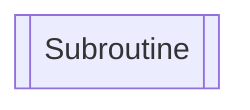

---


##### Cylindrical {ignore}

```
    ```mermaid {align=center}
    graph LR
        id1[(Database)]
    ```
```

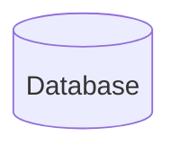

---


##### Circle {ignore}

```
    ```mermaid {align=center}
    graph LR
        id1((Circle))
    ```
```

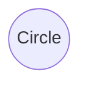

---


##### Asymmetric {ignore}

```
    ```mermaid {align=center}
    graph LR
        id1>Asymmetric]
    ```
```

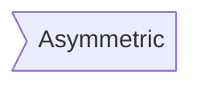

---


##### Rhombus {ignore}

```
    ```mermaid {align=center}
    graph LR
        id1{Rhombus}
    ```
```

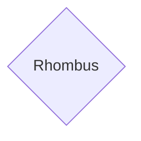

---


##### Hexagon {ignore}

```
    ```mermaid {align=center}
    graph LR
        id1{{Hexagon}}
    ```
```

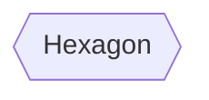

---

##### Parallelogram {ignore}

```
    ```mermaid {align=center}
    graph TD
        id1[/Parallelogram/]
    ```

    ```mermaid {align=center}
    graph TD
        id1[\Parallelogram\]
    ```
```

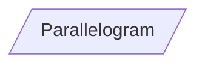

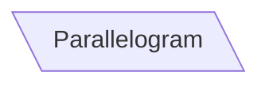

---

##### Trapezoid {ignore}

```
    ```mermaid {align=center}
    graph TD
        id1[/Trapezoid\]
    ```

    ```mermaid {align=center}
    graph TD
        id1[\Trapezoid/]
    ```
```

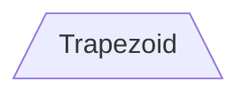

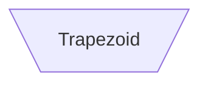


---

#### Interaction

```
    ```mermaid
    graph LR;
        A-->B;
        B-->C;
        C-->D;
        click A callback "Tooltip for a callback"
        click B "http://www.github.com" "This is a tooltip for a link"
        click A call callback() "Tooltip for a callback"
        click B href "http://www.github.com" "This is a tooltip for a link"
    ```
```

---

#### Comments {ignore}

- Use `%%` for comments.

```
    ```mermaid
    graph LR
    %% this is a comment A -- text --> B{node}
    A -- text --> B -- text2 --> C
    ```
```

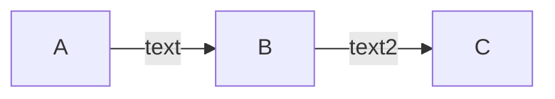


---


#### CSS Styling


##### Inline Styling {ignore}

```
    ```mermaid
    graph LR
        id1(Start)-->id2(Stop)
        style id1 fill:#f9f,stroke:#333,stroke-width:4px
        style id2 fill:#bbf,stroke:#f66,stroke-width:2px,color:#fff,stroke-dasharray: 5 5
    ```
```

```mermaid
graph LR
    id1(Start)-->id2(Stop)
    style id1 fill:#f9f,stroke:#333,stroke-width:4px
    style id2 fill:#bbf,stroke:#f66,stroke-width:2px,color:#fff,stroke-dasharray: 5 5
```


---


##### Inline Classes {ignore}

```
    ```mermaid
    graph LR
        A:::someclass --> B
        classDef someclass fill:#f96;
    ```
```

```mermaid
graph LR
    A:::someclass --> B
    classDef someclass fill:#f96;
```


---


##### Using Css Classes {ignore}

```html
<style>
    .cssClass > rect{
        fill:#FF0000;
        stroke:#FFFF00;
        stroke-width:4px;
    }
</style>
```

```
    ```mermaid
    graph LR;
        A-->B[AAA<span>BBB</span>];
        B-->D;
        class A cssClass;
    ```
```

```mermaid
graph LR;
    A-->B[AAA<span>BBB</span>];
    B-->D;
    class A cssClass;
```


---


---

### Gantt Chart

```mermaid {align="center"}
gantt
section Section
Completed    :done,    des1, 2014-01-06,2014-01-08
Active       :active,  des2, 2014-01-07, 3d
Parallel 1   :         des3, after des1, 1d
Parallel 2   :         des4, after des1, 1d
Parallel 3   :         des5, after des3, 1d
Parallel 4   :         des6, after des4, 1d
```

````
    ```mermaid {align="center"}
    gantt
    section Section
    Completed    :done,    des1, 2014-01-06,2014-01-08
    Active       :active,  des2, 2014-01-07, 3d
    Parallel 1   :         des3, after des1, 1d
    Parallel 2   :         des4, after des1, 1d
    Parallel 3   :         des5, after des3, 1d
    Parallel 4   :         des6, after des4, 1d
    ```
````

---

### Pie Chart

```mermaid {align="center"}
pie
"Dogs" : 386
"Cats" : 85
"Rats" : 15
```

````
    ```mermaid {align="center"}
    pie
    "Dogs" : 386
    "Cats" : 85
    "Rats" : 15
    ```
````

---

### Class Diagram

https://mermaid-js.github.io/mermaid/#/classDiagram

#### Example {ignore}

````
    ```mermaid {align="center"}
    classDiagram
    Class01 <|-- AveryLongClass : Cool
    link Class01 "http://www.github.com" "This is a tooltip for a link"
    <<interface>> Class01
    Class09 --> C2 : Where am i?
    Class09 --* C3
    Class09 --|> Class07
    callback Class09 "callbackFunction" "This is a tooltip for a callback"
    Class07 : equals()
    click Class07 call callbackFunction() "This is a tooltip for a callback"
    Class07 : Object[] elementData
    Class01 : size()
    Class01 : int chimp
    Class01 : int gorilla
    class Class10 {
      <<service>>
      int id
      size()
    }
    
    ```
````

```mermaid {align="center"}
classDiagram
Class01 <|-- AveryLongClass : Cool
link Class01 "http://www.github.com" "This is a tooltip for a link"
<<interface>> Class01
Class09 --> C2 : Where am i?
Class09 --* C3
Class09 --|> Class07
Class07 : equals()
Class07 : Object[] elementData
Class01 : size()
Class01 : int chimp
Class01 : int gorilla
class Class10 {
  <<service>>
  int id
  size()
}
```

```mermaid {align="center"}
%%{init: {'theme': 'default', 'themeVariables': { 'fontSize': 50 }}}%%
%%{config: { 'fontFamily': 'Menlo', 'fontSize': 18, 'fontWeight': 400} }%%
classDiagram
Class01 <|-- AveryLongClass : Cool
link Class01 "http://www.github.com" "This is a tooltip for a link"
<<interface>> Class01
Class09 --> C2 : Where am i?
Class09 --* C3
Class09 --|> Class07
Class07 : equals()
Class07 : Object[] elementData
Class01 : size()
Class01 : int chimp
Class01 : int gorilla
class Class10 {
  <<service>>
  int id
  size()
}
```


#### CSS Styling {ignore}

| Selector             | Description                                                       |
|----------------------|-------------------------------------------------------------------|
| `g.classGroup text`  | Styles for general class text                                     |
| `classGroup .title`  | Styles for general class title                                    |
| `g.classGroup rect`  | Styles for class diagram rectangle                                |
| `g.classGroup line`  | Styles for class diagram line                                     |
| `.classLabel .box`   | Styles for class label box                                        |
| `.classLabel .label` | Styles for class label text                                       |
| `composition`        | Styles for composition arrow head and arrow line                  |
| `aggregation`        | Styles for aggregation arrow head and arrow line(dashed or solid) |
| `dependency`         | Styles for dependency arrow head and arrow line                   |


```scss
body {
    background: white;
}

g.classGroup text {
    fill: $nodeBorder;
    stroke: none;
    font-family: 'trebuchet ms', verdana, arial;
    font-family: var(--mermaid-font-family);
    font-size: 10px;

    .title {
        font-weight: bolder;
    }
}

g.classGroup rect {
    fill: $nodeBkg;
    stroke: $nodeBorder;
}

g.classGroup line {
    stroke: $nodeBorder;
    stroke-width: 1;
}

.classLabel .box {
    stroke: none;
    stroke-width: 0;
    fill: $nodeBkg;
    opacity: 0.5;
}

.classLabel .label {
    fill: $nodeBorder;
    font-size: 10px;
}

.relation {
    stroke: $nodeBorder;
    stroke-width: 1;
    fill: none;
}

@mixin composition {
    fill: $nodeBorder;
    stroke: $nodeBorder;
    stroke-width: 1;
}

#compositionStart {
    @include composition;
}

#compositionEnd {
    @include composition;
}

@mixin aggregation {
    fill: $nodeBkg;
    stroke: $nodeBorder;
    stroke-width: 1;
}

#aggregationStart {
    @include aggregation;
}

#aggregationEnd {
    @include aggregation;
}

#dependencyStart {
    @include composition;
}

#dependencyEnd {
    @include composition;
}

#extensionStart {
    @include composition;
}

#extensionEnd {
    @include composition;
}
```


---

### Entity Relationship Diagram

https://mermaid-js.github.io/mermaid/#/entityRelationshipDiagram


#### Example {ignore}

```
    ```mermaid {align="center"}
    erDiagram
        CUSTOMER ||--o{ ORDER : places
        ORDER ||--|{ LINE-ITEM : contains
        CUSTOMER }|..|{ DELIVERY-ADDRESS : uses
    ```
```


```mermaid {align="center"}
erDiagram
    CUSTOMER ||--o{ ORDER : places
    ORDER ||--|{ LINE-ITEM : contains
    CUSTOMER }|..|{ DELIVERY-ADDRESS : uses
```


#### Relationships {ignore}

| Value (left) | Value (right) | Meaning                       |
|:------------:|:-------------:|-------------------------------|
|     `|o`     |     `o|`      | Zero or one                   |
|     `||`     |     `||`      | Exactly one                   |
|     `}o`     |     `o{`      | Zero or more (no upper limit) |
|     `}|`     |     `|{`      | One or more (no upper limit)  |


#### CSS Styling {ignore}

| Selector                   | Description                                           |
|----------------------------|-------------------------------------------------------|
| `.er.attributeBoxEven`     | The box containing attributes on even-numbered rows   |
| `.er.attributeBoxOdd`      | The box containing attributes on odd-numbered rows    |
| `.er.entityBox`            | The box representing an entity                        |
| `.er.entityLabel`          | The label for an entity                               |
| `.er.relationshipLabel`    | The label for a relationship                          |
| `.er.relationshipLabelBox` | The box surrounding a relationship label              |
| `.er.relationshipLine`     | The line representing a relationship between entities |


---


### State Diagram

```mermaid {align="center"}
stateDiagram-v2
[*] --> Still
Still --> [*]
Still --> Moving
Moving --> Still
Moving --> Crash
Crash --> [*]
```

````
    ```mermaid {align="center"}
    stateDiagram-v2
    [*] --> Still
    Still --> [*]
    Still --> Moving
    Moving --> Still
    Moving --> Crash
    Crash --> [*]
    ```
````

---

### User Journey

```mermaid {align="center"}
  journey
    title My working day
    section Go to work
      Make tea: 5: Me
      Go upstairs: 3: Me
      Do work: 1: Me, Cat
    section Go home
      Go downstairs: 5: Me
      Sit down: 3: Me
```

````
    ```mermaid {align="center"}
      journey
        title My working day
        section Go to work
          Make tea: 5: Me
          Go upstairs: 3: Me
          Do work: 1: Me, Cat
        section Go home
          Go downstairs: 5: Me
          Sit down: 3: Me
    ```
````

---

### Sequence

See More [Sequence Diagrams](#js-sequence-diagramshttpsbrampgithubiojs-sequence-diagrams)

```mermaid {align="center"}
sequenceDiagram
Alice->>John: Hello John, how are you?
loop Healthcheck
    John->>John: Fight against hypochondria
end
Note right of John: Rational thoughts!
John-->>Alice: Great!
John->>Bob: How about you?
Bob-->>John: Jolly good!
```

````
    ```mermaid {align="center"}
    sequenceDiagram
    Alice->>John: Hello John, how are you?
    loop Healthcheck
        John->>John: Fight against hypochondria
    end
    Note right of John: Rational thoughts!
    John-->>Alice: Great!
    John->>Bob: How about you?
    Bob-->>John: Jolly good!
    ```
````

---

### Directives

| Directive    | Example                                                                      |
|--------------|------------------------------------------------------------------------------|
| `%%init%%`   | `%%{init: { 'logLevel': 'debug', 'theme': 'dark' } }%%`                      |
| `%%config%%` | `%%{config: { 'fontFamily': 'Menlo', 'fontSize': 18, 'fontWeight': 400} }%%` |


```
    %%{init: { 'logLevel': 'debug', 'theme': 'dark' } }%%
    sequenceDiagram
    %%{config: { 'fontFamily': 'Menlo', 'fontSize': 18, 'fontWeight': 400} }%%
    Alice->>Bob: Hi Bob
    Bob->>Alice: Hi Alice
```

```mermaid
%%{init: { 'logLevel': 'debug', 'theme': 'dark' } }%%
sequenceDiagram
%%{config: { 'fontFamily': 'Menlo', 'fontSize': 18, 'fontWeight': 400} }%%
Alice->>Bob: Hi Bob
Bob->>Alice: Hi Alice
```


### Theming

Larger flowchart with some styling

```
    ```mermaid
    graph TB
        sq[Square shape] --> ci((Circle shape))

        subgraph A
            od>Odd shape]-- Two line<br/>edge comment --> ro
            di{Diamond with <br/> line break} -.-> ro(Rounded<br>square<br>shape)
            di==>ro2(Rounded square shape)
        end

        %% Notice that no text in shape are added here instead that is appended further down
        e --> od3>Really long text with linebreak<br>in an Odd shape]

        %% Comments after double percent signs
        e((Inner / circle<br>and some odd <br>special characters)) --> f(,.?!+-*ز)

        cyr[Cyrillic]-->cyr2((Circle shape Начало));

        classDef green fill:#9f6,stroke:#333,stroke-width:2px;
        classDef orange fill:#f96,stroke:#333,stroke-width:4px;
        class sq,e green
        class di orange
    ```
```


```mermaid
graph TB
    sq[Square shape] --> ci((Circle shape))

    subgraph A
        od>Odd shape]-- Two line<br/>edge comment --> ro
        di{Diamond with <br/> line break} -.-> ro(Rounded<br>square<br>shape)
        di==>ro2(Rounded square shape)
    end

    %% Notice that no text in shape are added here instead that is appended further down
    e --> od3>Really long text with linebreak<br>in an Odd shape]

    %% Comments after double percent signs
    e((Inner / circle<br>and some odd <br>special characters)) --> f(,.?!+-*ز)

    cyr[Cyrillic]-->cyr2((Circle shape Начало));

     classDef green fill:#9f6,stroke:#333,stroke-width:2px;
     classDef orange fill:#f96,stroke:#333,stroke-width:4px;
     class sq,e green
     class di orange
```


#### Theme Variables


- Uses `%%init%%`.

```mermaid
%%{init: {'theme': 'base', 'themeVariables': { 'primaryColor': '#ff0000'}}}%%
graph TD
    A[Christmas] -->|Get money| B(Go shopping)
    B --> C{Let me think}
    B --> G[/Another/]
    C ==>|One| D[Laptop]
    C -->|Two| E[iPhone]
    C -->|Three| F[fa:fa-car Car]
    subgraph section
    C
    D
    E
    F
    G
    end
```

---

#### Theme Variables Reference Table

https://mermaid-js.github.io/mermaid/#/theming?id=theme-variables-reference-table

- Variables that are unique to some diagrams can be affected by changes in Theme Variables

| Variable             | Default/Base/Factor value      | Calc | Description                                                                                                                      |
|----------------------|--------------------------------|------|----------------------------------------------------------------------------------------------------------------------------------|
| darkMode             | false                          |      | Boolean Value that dictates how to calculate colors. "true" will activate darkmode.                                              |
| background           | #f4f4f4                        |      | Used to calculate color for items that should either be background colored or contrasting to the background.                     |
| primaryColor         | #fff4dd                        |      | Color to be used as background in nodes, other colors will be derived from this                                                  |
| fontFamily           | "trebuchet ms", verdana, arial |      |                                                                                                                                  |
| fontSize             | 16px                           |      | Font Size, in pixels                                                                                                             |
| secondaryColor       | based on primaryColor          | *    |                                                                                                                                  |
| tertiaryColor        | based on primaryColor          | *    |                                                                                                                                  |
| primaryBorderColor   | based on primaryColor          | *    | Color to be used as border in nodes using primaryColor                                                                           |
| primaryTextColor     | based on darkMode #ddd/#333    | *    | Color to be used as text color in nodes using primaryColor                                                                       |
| secondaryBorderColor | based on secondaryColor        | *    | Color to be used as border in nodes using secondaryColor                                                                         |
| secondaryTextColor   | based on secondaryColor        | *    | Color to be used as text color in nodes using secondaryColor                                                                     |
| tertiaryBorderColor  | based on tertiaryColor         | *    | Color to be used as border in nodes using tertiaryColor                                                                          |
| tertiaryTextColor    | based on tertiaryColor         | *    | Color to be used as text color in nodes using tertiaryColor                                                                      |
| noteBkgColor         | #fff5ad                        |      | Color used as background in notes                                                                                                |
| noteTextColor        | #333                           |      | Text color in note rectangles.                                                                                                   |
| noteBorderColor      | based on noteBkgColor          | *    | Border color in note rectangles.                                                                                                 |
| lineColor            | based on background            | *    |                                                                                                                                  |
| textColor            | based on primaryTextColor      | *    | Text in diagram over the background for instance text on labels and on signals in sequence diagram or the title in gantt diagram |
| mainBkg              | based on primaryColor          | *    | Background in flowchart objects like rects/circles, class diagram classes, sequence diagram etc                                  |
| errorBkgColor        | tertiaryColor                  | *    | Color for syntax error message                                                                                                   |
| errorTextColor       | tertiaryTextColor              | *    | Color for syntax error message                                                                                                   |


---

## Sequence Diagrams

Documentation: https://bramp.github.io/js-sequence-diagrams/

### Simple Example

```sequence {align="center"}
Object1->Object2: Something
```

````
    ```sequence {align="center"}
    Object1->Object2: Something
    ```
````

---

### Participants

```sequence {align="center"}
participant C
participant B
participant A
Note right of A: By listing the participants\n you can change their order
```

````
    ```sequence {align="center"}
    participant C
    participant B
    participant A
    Note right of A: By listing the participants\n you can change their order
    ```
````

---

### Lines

```sequence {align="center"}
Title: Here is a title
A->B: Normal line
B-->C: Dashed line
C->>D: Open arrow
D-->>A: Dashed open arrow
```

````
    ```sequence {align="center"}
    Title: Here is a title
    A->B: Normal line
    B-->C: Dashed line
    C->>D: Open arrow
    D-->>A: Dashed open arrow
    ```
````

---

### Comments and Notes

```sequence {align="center"}
# Example of a comment.
Note left of A: Note to the\n left of A
Note right of A: Note to the\n right of A
Note over A: Note over A
Note over A,B: Note over both A and B
```

````
    ```sequence {align="center"}
    # Example of a comment.
    Note left of A: Note to the\n left of A
    Note right of A: Note to the\n right of A
    Note over A: Note over A
    Note over A,B: Note over both A and B
    ```
````

---

### Hand Drawn Theme

```sequence {theme="hand"; align="center"}
Title: Example of a hand drawn graph
Andrew->China: Says Hello
Note right of China: China thinks\nabout it
China-->Andrew: How are you?
Andrew->>China: I am good thanks!
```

````
    ```sequence {theme="hand"; align="center"}
    Title: Example of a hand drawn graph
    Andrew->China: Says Hello
    Note right of China: China thinks\nabout it
    China-->Andrew: How are you?
    Andrew->>China: I am good thanks!
    ```
````

